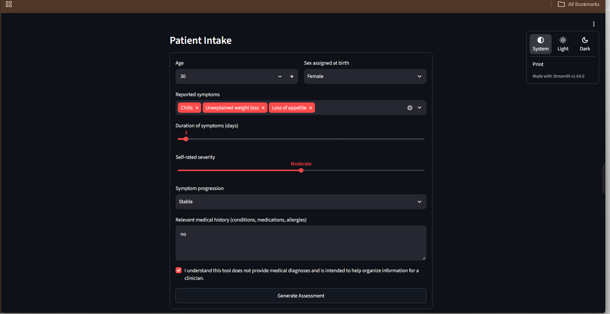
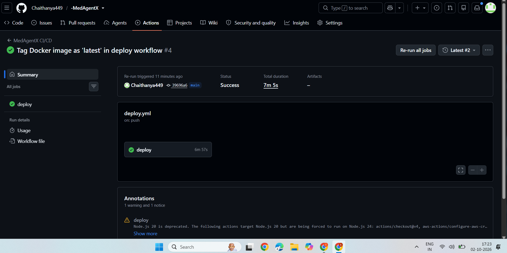
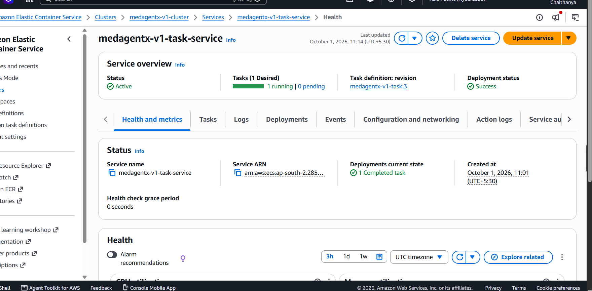
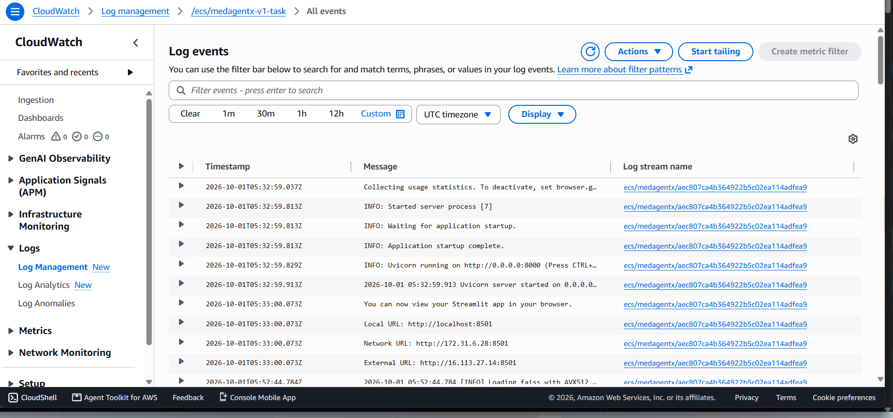

# MedAwareX


> A safety-first patient-awareness system combining medical knowledge retrieval, deterministic risk assessment, and layered safety controls.

MedAwareX helps users **understand and organize self-reported symptoms** using evidence retrieved from a curated medical knowledge base. It does **not diagnose**. It returns a patient summary, possible condition matches with supporting evidence, a rule-based risk level, and safety guidance.

No external LLM, API key, or model service is needed at runtime.

> **Important:** MedAwareX is built for educational and informational use. It does not provide medical diagnosis or treatment.

---

## Demo



---

## How It Works

```
Streamlit UI
    ↓
FastAPI /intake
    ↓
Pydantic Validation
    ↓
Safety Gate 1 ── red flag ──► Urgent response (stop)
    ↓
Local Retrieval (SentenceTransformers + FAISS)
    ↓
Deterministic Risk Engine
    ↓
Assessment Builder
    ↓
Safety Gate 2
    ↓
Patient Awareness Report
```

| Component | Purpose |
|---|---|
| Safety Gate 1 | Stops early on emergency red flags (chest pain, stroke signs, severe bleeding, etc.) |
| Local Retrieval | Finds relevant passages from the medical knowledge base using `all-MiniLM-L6-v2` embeddings and FAISS |
| Risk Engine | Assigns LOW / MODERATE / HIGH using fixed rules, independent of any model |
| Assessment Builder | Combines patient data, retrieved evidence, and risk into one structured result |
| Safety Gate 2 | Blocks diagnostic wording, checks the disclaimer, and checks consistency with the risk result |

### Risk Rules

```
Severe + Worsening        → HIGH
Severe + >= 7 days        → HIGH
Moderate + Worsening      → MODERATE
Moderate + >= 7 days      → MODERATE
Otherwise                 → LOW
```

These are rule-based heuristics, not clinically validated triage criteria.

### Knowledge Base

Reference material organized from Mayo Clinic, CDC, NIH, WHO, Cleveland Clinic, MedlinePlus, and NHS.

---

## Tech Stack

| Layer | Stack |
|---|---|
| Frontend | Streamlit |
| Backend | FastAPI, Uvicorn, Pydantic |
| Retrieval | SentenceTransformers, FAISS |
| Containerization | Docker |
| Cloud | AWS ECS, Fargate, ECR, CloudWatch |
| CI/CD | GitHub Actions + AWS OIDC |

---

## Repository Structure

```
MedAwareX/
├── .github/workflows/deploy.yml
├── app/
│   ├── assessment/        # builder, local assessment
│   └── rag/               # chunking, embeddings, retrieval, vector store
├── backend/
│   ├── main.py
│   ├── schemas.py
│   ├── risk/              # risk engine
│   └── safety/            # red flags, safety gates 1 and 2
├── deployment_evidence/   # UI, CI/CD, ECS and CloudWatch screenshots
├── frontend/streamlit_app.py
├── knowledge_base/
│   ├── raw/
│   └── vector_store/
├── Dockerfile
└── requirements.txt
```

---

## Run Locally

```bash
git clone https://github.com/Chaithanya449/MedAwareX.git
cd MedAwareX

python -m venv .venv
.\.venv\Scripts\Activate.ps1      # Windows PowerShell
pip install -r requirements.txt

uvicorn backend.main:app --reload --port 8000
```

In a second terminal:

```bash
streamlit run frontend/streamlit_app.py
```

### Docker

```bash
docker build -t medawarex .
docker run -p 8501:8501 -p 8000:8000 medawarex
```

Open `http://localhost:8501`.

---

## AWS Deployment and CI/CD

Every push to `main` runs this workflow:

```
GitHub Actions → AWS OIDC → Docker build → Amazon ECR → ECS / Fargate → CloudWatch
```

- Images are tagged with the commit SHA and `latest`.
- AWS OIDC is used, so no long-lived AWS access keys are stored.

**GitHub Actions pipeline**



**ECS service running on Fargate**



**CloudWatch logs**



---

## Example Input

```
Age: 25
Sex: Female
Symptoms: Fatigue, Shortness of breath
Duration: 3 days
Severity: Moderate
Progression: Stable
```

---

## Disclaimer

MedAwareX is a software project built for educational and engineering purposes. It does not provide medical diagnosis, treatment, or emergency services and does not replace advice from a qualified healthcare professional.

**For a medical emergency, contact local emergency services immediately.**
